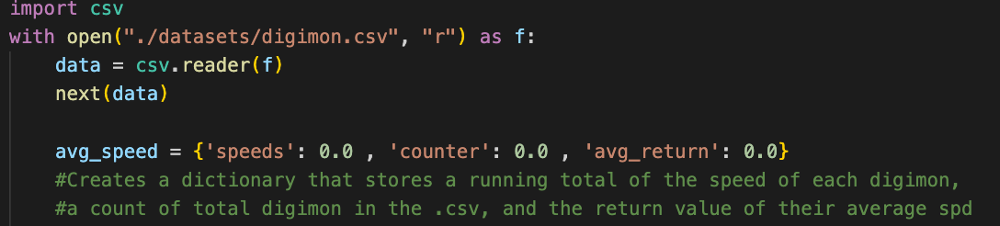

# Dive into the Digimon Universe 

**Lab 1** presented me with a series of tasks; out I emerge victorious and near-fluent in the intricacies of the Digimon and how to sift through data on them.

This posts guides all readers through my thought processes and questions, a manifestation of my perseverance, as I worked to complete Lab 1. 

Let's begin with question 1...

## What is the Average Speed of all Digimon? 

The first question in the lab asks for the average speed (spd) of all Digimon. To tackle this problem, I took a similar approach as I did to find the average bill lengths and average masses of each penguin species when I completed the Reading Files practice pre-lab for this project. 

To actually write the program, after opening the Digimon .csv file, I initialized a dictionary, "avg_speed," where I stored two counter keys, "speeds" (sum of speeds of each Digimon) and "counter" (total Digimon in the .csv) which would be divided ("speeds"/"counter") to obtain the average speed for all Digimon in the file. This average would be found after "speeds" and "counter" were summed for all the Digimon in the .csv and would be stored as the value for the key "avg_return." 

To actually iterate through the .csv and update the "speeds" and "counter" keys, I created a for-loop that iterated row by row through the Digimon .csv (see image below). In each iteration, "speeds" updated by the speed of the Digimon at the current row and "counter" updated by 1. Once the entire .csv was looped through, I found the average speed of the Digimon ("speeds"/"counter") and stored this as the value of key "avg_return." 

Notice that avg_return is calculated outside of the for-loop, because I was only interested in the average speed of **all** Digimon; inside of the for-loop, avg_return would be continuously updated with values that irrelevant to the actual question (which would be an unnecessary use of processing power). 

I printed the value of key "avg_return" in the dictionary "avg_speed" to obtain the answer to question 1. See the two images below for my print statement and the output in the terminal.  

Now, lets move swiftly to question 2 :) 

## Write a function that can count the number of Digimon with a specific attribute.

The first step I took was to create what I see as the "scaffolding" for my program (see image below). After opening the .csv file, I created two reader objects of the .csv file. Interestingly, the object, "csv_digi," specifically was separated with a delimeter, commas (this will be critical to the next stop of my program). 
Then, I created the function, counterDig, that would return the numerical answer to question 2; this function takes in two parameters, a column_name (will be stage, type, or attribute) and characteristic (ex: Virus). 
Finally, I initialized two storage variables: "column_names" to store a list of the headings in the .csv (see next image) and also "attribute_count," which would eventually be returned and printed as the answer to this question. 

**Note:** Notice how as opposed to the beginning of my program for question 1, there is no line that says "next(data)." This is because I am actually interested in the headers for each column, as you will see in the following image/desription. 

After initializing my function and csv.reader object and creating my storage variables, I began tackling this question with a goal: build my program in the least "hard-coded" way possible. The first step on my agenda was to find a way to store the numberical index of the column a given attribute will be in so that the code can specifically compare the given characteristic within that attribute to each row in the column. Specifically, nowhere in my program did I want to write, for example, "row[4]." 

To achieve this, I created a for loop that would loop through the .csv file (reader object) and create a list of all the column names (headers) in the file. Outside of the loop, I created a storage variable, "column_index," to actually find and store the index of the given column name (passed into the function - "column_name") based on its location in the list created in the for-loop. Delimiting the reader object, "csv_digi," with commas was important to the functionning of this loop. 

Onwards to question 3: a slew of thoughts and ideas, and lots of fun!!  

## If your team only has 15 Memory, name a team of up to 3 Digimon that has at least 300 attack (Atk) in total.

Here I will put images and answers 

# Reflection 
First of all, I collaborated with my peer, Nate Garelik, to discuss ideas and approaches to this lab. In addition, he and I worked together to gain a understanding of beautiful jekyll and how to configure our websites. 

Add more reflection here 

## Thank you so much for reading! See you again soon :)
