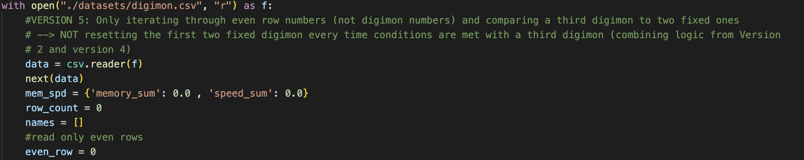

# Into the Digi-Verse

**Lab 1** presented me with a series of tasks; out I emerge victorious and near-fluent in the intricacies of the Digimon and how to sift through data on them.

This posts guides all readers through my thought processes and questions, a manifestation of my perseverance, as I worked to complete Lab 1. 

Let's begin with question 1...

## What is the Average Speed of all Digimon? 

The first question in the lab asks for the average speed (spd) of all Digimon. To tackle this problem, I took a similar approach as I did to find the average bill lengths and average masses of each penguin species when I completed the Reading Files practice pre-lab for this project. 

To actually write the program, after opening the Digimon .csv file, I initialized a dictionary, "avg_speed," where I stored two counter keys, "speeds" (sum of speeds of each Digimon) and "counter" (total Digimon in the .csv) which would be divided ("speeds"/"counter") to obtain the average speed for all Digimon in the file. This average would be found after "speeds" and "counter" were summed for all the Digimon in the .csv and would be stored as the value for the key "avg_return." 

To actually iterate through the .csv and update the "speeds" and "counter" keys, I created a for-loop that iterated row by row through the Digimon .csv (see image below). In each iteration, "speeds" updated by the speed of the Digimon at the current row and "counter" updated by 1. Once the entire .csv was looped through, I found the average speed of the Digimon ("speeds"/"counter") and stored this as the value of key "avg_return." 

Notice that avg_return is calculated outside of the for-loop, because I was only interested in the average speed of **all** Digimon; inside of the for-loop, avg_return would be continuously updated with values that irrelevant to the actual question (which would be an unnecessary use of processing power). 

I printed the value of key "avg_return" in the dictionary "avg_speed" to obtain the answer to question 1. See the two images below for my print statement and the output in the terminal.  

Now, lets move swiftly to question 2 :) 

## Write a function that can count the number of Digimon with a specific attribute.

The first step I took was to create what I see as the "scaffolding" for my program (see image below). After opening the .csv file, I created two reader objects of the .csv file. Interestingly, the object, "csv_digi," specifically was separated with a delimeter, commas (this will be critical to the next step of my program). 
Then, I created the function, counterDig, that would return the numerical answer to question 2; this function takes in two parameters, a column_name (will be stage, type, or attribute) and characteristic (ex: Virus). 
Finally, I initialized two storage variables: "column_names" to store a list of the headings in the .csv (see next image) and also "attribute_count," which would eventually be returned and printed as the answer to this question. 

**Note:** Notice how as opposed to the beginning of my program for question 1, there is no line that says "next(data)." This is because I am actually interested in the headers for each column, as you will see in the following image/desription. 

After initializing my function and csv.reader object and creating my storage variables, I began tackling this question with a goal: build my program in the least "hard-coded" way possible. The first step on my agenda was to find a way to store the numberical index of the column a given attribute will be in so that the code can specifically compare the given characteristic within that attribute to each row in the column. Specifically, nowhere in my program did I want to write, for example, "row[4]." 

To achieve this, I created a for loop that would loop through the .csv file (reader object) and create a list of all the column names (headers) in the file. Outside of the loop, I created a storage variable, "column_index," to actually find and store the index of the given column name (passed into the function - "column_name") based on its location in the list created in the for-loop. Delimiting the reader object, "csv_digi," with commas was important to the functionning of this loop. 

After I could obtain the index of the column where the characteristic passed into the function would be found, I created my main for-loop that would actually count the number of digimon with a specific characteristic. Looping through each row of the .csv file, I checked if the specific characteristic of a digimon at the current iteration of the for loop (in the column matching the one passed into the function) matched the given characteristic passed into the function. 
If the loop found a match, the value of "attribute_count" would be incrimented by one, and if not, then the loop would simply move onto the next row. After I looped through the entire .csv file, I returned the value of "attribute_count."  (see image below)

The following set of six images are sample print statements with their terminal outputs that display the functionality of my program: 

Please note that I consulted the website, "Geeks for Geeks" to gain a better understanding of how to get specific column indexes. See more here: https://www.geeksforgeeks.org/get-column-names-from-csv-using-python/?ref=lbp

Onwards to question 3: a slew of thoughts and ideas, and lots of fun!!  

## If your team only has 15 Memory, name a team of up to 3 Digimon that has at least 300 attack (Atk) in total.

### Version 1: A team of three consecutive digimon that meet requirements 

My first approach to this question was just to create a loop that would check consecutive sets of three digimon and see if they met the requirements set out by this problem. The first step I took was to initialize a storage dictionary for the memories and speeds of sets of three Digimon, a counter for the  number of rows iterated through by the for loop (this would reset every three rows - for sets of three digimon), and list of names that would be printed for every three digimon that met the conditions. (see image below)

As you will see in the image directly below, I created a for-loop (with comments for clarity) that achieves what I set out to do in version 1. 

Below is the output of the for-loop in version 1 for the entire .csv file. 

### Version 2: A team of three consecutive digimon in EVEN rows that meet requirements 

The logic for this version is exactly the same as for version 1; the only difference is that the for-loop only iterates through even rows, as I coded this into the loop. I began to create more variation in how I answered question 3 because I wanted to see how many combinations of digimon that met the requirements I could find.

Below is the code for the for-loop in version 2 - the only difference from version 1 is that it also keeps track of even rows and ensures that the for loop only iterates through even rows of the .csv file. 

Below is the output of the for-loop in version 2 for the entire .csv file.

### Version 3: A team of three digimon that meet requirements by fixing the first two and finding a third
(resetting the first two fixed digimon once a team of three is found) 

In this version of my answer, I slightly switched-up my methodology: here, instead of iterating through sets of three digimon and resetting every three, I kept two "fixed" digimon and checked them against a third in each row - if that set of three digimon met the requirements of the problem, it would be printed and the fixed digimon would also be reset to the next two digimon below the row containing the third digimon in the previous set (I know it's a mouthful, but I was very excited about this idea). 

Notice how row_count gets reset to zero if a set of three digimon meet the requirements of the problem; if the set of three digimon at the current iteration of the loop do not meet the requirements, row_count is set back down to 2 (not zero), holding onto the first two digimon in the set, but then checking them against the following third digimon in the row below the one that did not work. 

Below is the output of the for-loop in version 3 for the entire .csv file.

### Version 4: A second team of three digimon that meet requirements by fixing the first two and finding a third
(**NOT** resetting the first two fixed digimon once a team of three is found) 

The logic of this program is exactly the same as that for version 3 - the only difference is that the first two digimon being checked against a third are never reset, regardless of if a set of three meets the conditions or not. 

Below is the output of the for-loop in version 4 for the entire .csv file.

### Version 5: A team of three digimon from EVEN rows that meet requirements by fixing the first two and finding a third
(resetting the first two fixed digimon once a team of three is found) 

This version combines the logic of versions 2 and 4. 

Below is the output of the for-loop in version 5 for the entire .csv file.

### Version 6: A second of three digimon from EVEN rows that meet requirements by fixing the first two and finding a third
(**NOT** resetting the first two fixed digimon once a team of three is found) 

This version combines the logic of versions 2 and 3. 

Below is the output of the for-loop in version 6 for the entire .csv file.

In reflection, specifically to the solutions for problem 3, I would say that my work is a testament to my quest to look at mutliple ways to solve one problem. Originally, as I considered ways to go about programming an answer to this question, I was looking for a way to write a function or loop that would find all possible combinations of Digimon that would meet the requirements, in the least hard-coded way possible. While I was not able to find a solution in that way during the time I had to work on this lab, I, instead, worked to create variation in how I solved the problem to show the large set of possible solutions contained in the .csv. Also, I think the next step I could take in working on this problem would be to store all of the combinations my separate for-loops find in one large dictionary; this would organize my answers and also make it so I could possibly call upon stored information again/more efficiently. 
Ultimately, I just had a lot of fun working with my ideas and code as I challenged myself to find more than one team of Digimon that would meet the parameters of the question. 

# General Reflection 
First of all, I collaborated with my peer, Nate Garelik, to discuss ideas and approaches to this lab. In addition, he and I worked together to gain a understanding of beautiful jekyll and how to configure our websites. 

Overall, I learned a lot about both how to utilize dictionaries, lists, and loops to optimize how I read through .csv files, and also about myself as a programmer and dynamic problem-solver. I think that the most critical aspect of my coding process was the "planning-stage," whether it was a mental visualization of how I was going to write my program or a written down (messy and scribbled-over) list of steps (my "plan of action," if you will). I also found this step to be the most difficult one because I was often overwhelmed by ideas and spent time forcing myself to simplify redundant over-complications and mapping out an achievable structure of a program. Once I got that done, I really enjoyed playing around with different functionalities and ways to read through .csv files. I also had a great time personalizing my blog and getting to know the ins and outs of Beautiful Jekyll. 
As for future considerations, I mostly aim to spend more time considering ways to solve problems that are completely different from my original approach; I hope to spend more time doing research on different data structures and really cool ways to maximize efficiency and accuracy in my code. 

## Thank you so much for reading! See you again soon :)
