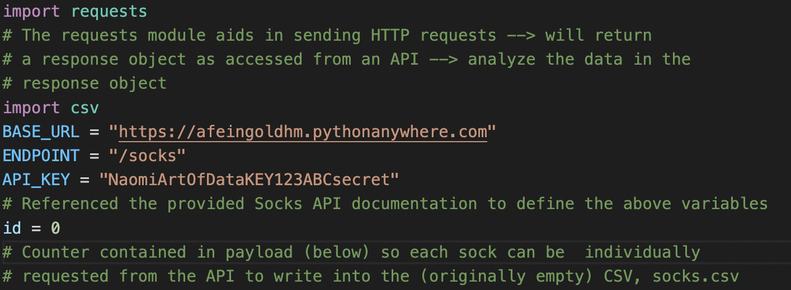
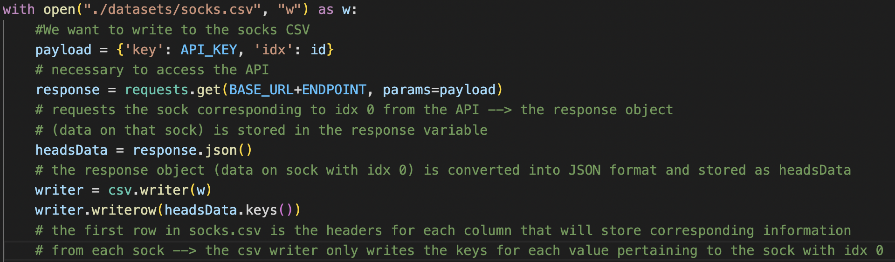
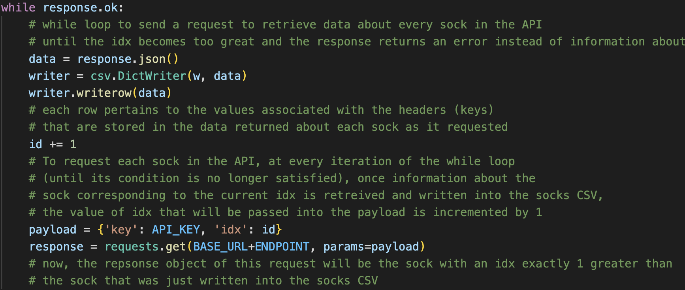
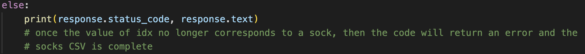
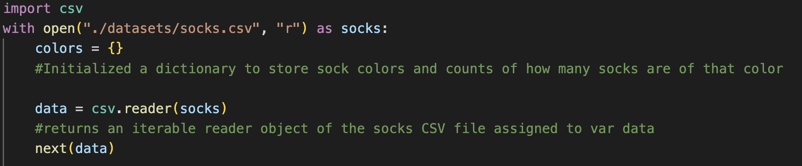
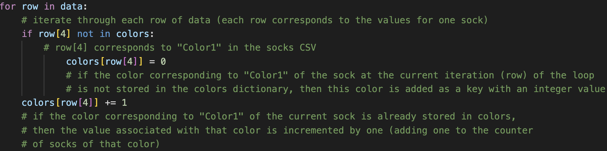
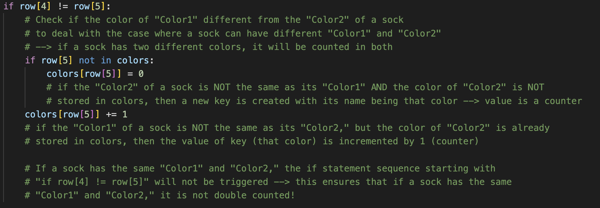
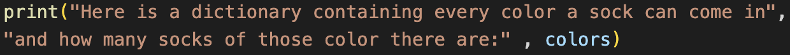
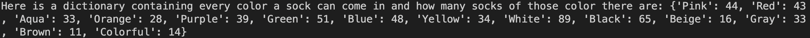

# Into the Animal Crossing-Verse 
### (yes, animal crossing-verse -- a more clunky version of into the digi-verse, but I like continuity) 

This post provides a glimpse into my process of working through solutions to lab 2. Let's start with a look into how I accessed **Socks API** provided for this lab and obtained the dataset to analyze... 

## Part 1: Generating a CSV of Socks

## Part 2: Analyzing Sock Variation 

I am not, however, satisfied with my VS Code terminal output (aesthetically), so here is my final answer to the question
on sock variation, but neater: 

The socks that have the greatest variation are:
- argyle crew socks 
- color-blocked socks
- frilly knee-high socks
- holey tights
- kiddie socks
- mixed-tweed socks
- no-show socks
- semi-opaque socks
- semi-opaque tights
- sequin leggings
- simple-accent socks
- striped socks
- striped tights
- tube socks
- ultra no-show socks
- vivid leggings
- vivid socks
- vivid tights

All 18 of these socks have a variation of 8 (as stored in the "greatest_variation" variable) . 

## Part 3: Socks! Colorful Socks!

Again, I find myself unsatisfied (aesthetically) with the VS Code terminal output. Here is a nicer (in my humble opinion) version of my answer to this lab question...

Every color a sock can be and how many socks of that color there are (parameters for followed as instructed in lab description): 
- Pink: 44
- Red: 43
- Aqua: 33
- Orange: 28
- Purple: 39
- Green: 51
- Blue: 48
- Yellow: 34
- White: 89
- Black: 65
- Beige: 16
- Gray: 33 
- Brown: 11
- Colorful: 14

## Part 4: Relflection

