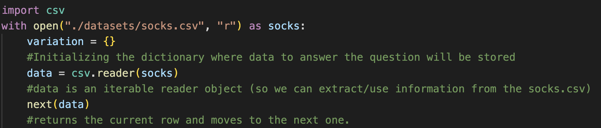
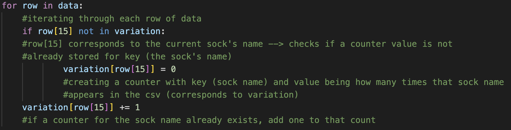
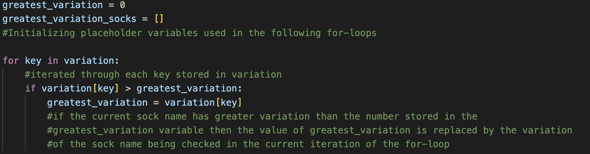
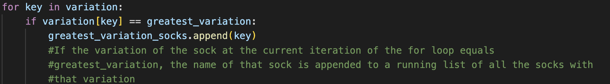
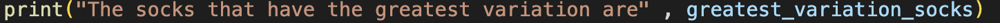
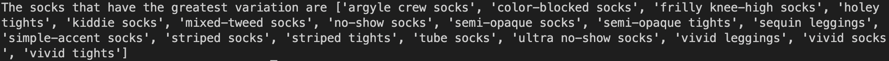
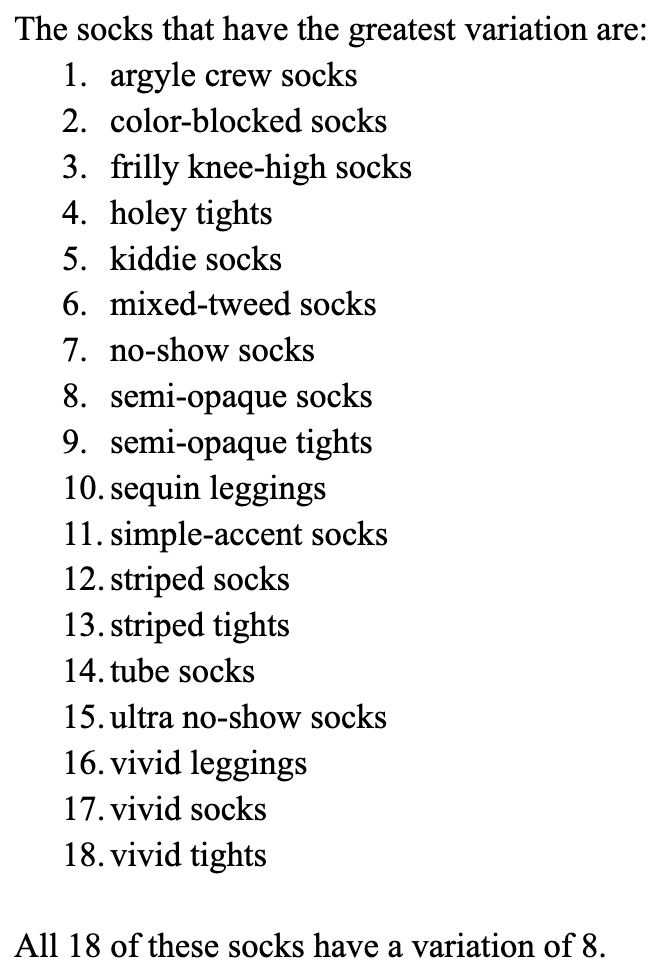

# Into the Animal Crossing-Verse 
### (this is clunkier than I'd like but #whatever) 

This post provides a glimpse into my process of working through solutions to lab 2. Let's start with a look into how I accessed and obtained data from the **Socks API** provided for this lab... 

## Part 1: Generating a CSV of Socks

## Part 2: Analyzing Sock Variation 

## Part 3: Socks! Colorful Socks!

## Part 4: Relflection

