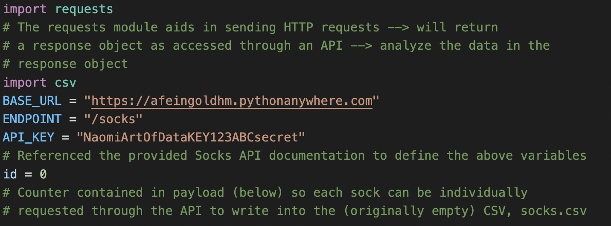
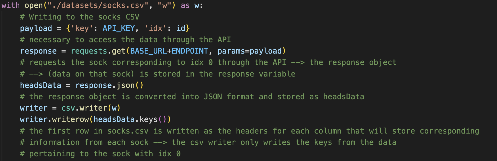
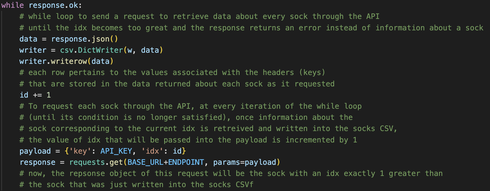
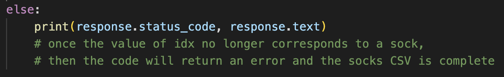
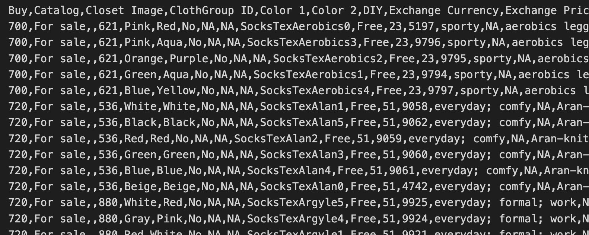

# Into the Animal Crossing-Verse 
### (yes, animal crossing-verse -- a more clunky version of into the digi-verse, but I like continuity) 

This post provides a glimpse into my process of working through solutions to lab 2. I've curated this blog post to optimize my (large) audience's understanding of my thinking - please refer to my comments (in the code screenshots) for in-depth explanations of why I wrote each line of code. Let's start with a look into how I used **Socks API** provided for this lab and to obtain the socks dataset to analyze... 

## Part 1: Generating a CSV of Socks

First, I imported requests and csv and set up some useful variables: 

Then, it was time to open up the CSV I created (socks.csv) where I planned to write the data on each sock. My first move was to write the first row of my CSV to contain headers for each column of data, for organization's sake. I retrieved the headers from the keys in each key/value pair stored in the data for the sock at index 0. 

Once socks.csv had headers, I created a while loop that would allow me to write in data for every sock accessed through the provided API. The while loop was crucial to continuously incrementing the id in the payload that was passed into my request; this would allow me to obtain data for every sock because each id number corresponds to a different sock.

When the id value (in the payload) gets to a point where it does not correspond to a sock, then the while loop stops being triggered - instead, the request sent through the API results in an error: receiving this error is how I know socks.csv is successfully populated with data on every existing sock.

Albeit a bit hard to read (for a human, that is), here is a sample of what my socks.csv file ended up looking like (not the full file --> cut off in the screenshot):

## Part 2: Analyzing Sock Variation 

Once I had a CSV of all the socks, I set out to find out which sock has the most variations. Because I found more than one answer, my answer to this question ended up being a list of all of them. 

My first step in answering this question (after I imported the csv module) was to open up my socks CSV. Once I opened this file to read from, I set up a dictionary called variation where I would keep counter key/value pairs for each type of sock (as denoted by its name). The keys stored in variation are the sock name, and the values are an integer count. 

Then, I created a for loop that iterates through every row in my socks.csv (after skipping the first row of headers because of the next(data) line). This for loops functions to create the key/value pairs stored in the variation dictionary that I explained in the text just above. 

At this point in the program, the variation dictionary only stores the variation counts for each sock name, but it does not tell us which sock(s) have the greatest variation. Therefore, I initialized a placeholder variable (greatest_variation) to store the integer value that corresponds to the greatest value of variation amongst all socks. And, greatest_variation_socks, once utilized in code, ends up storing a list of all socks names (keys) that have values equivalent to greatest_variation. 

The first of the following two for loops (just below) finds what the greatest variation (value) is amongst the socks and stores it in the greatest_variation variable. 

The second of the for loops I created for this part of the lab creates a list (stored in greatest_variation_socks) of all the socks with the greatest variation by comparing the variation of each sock name to the value just assigned to variable, greatest_variation. 

Below is how I print my final answer, as well as the terminal output. 

I am not, however, satisfied with the VS Code terminal output (aesthetically), so here is my final answer to the question
on sock variation, but neater: 

The socks that have the greatest variation are:
- argyle crew socks 
- color-blocked socks
- frilly knee-high socks
- holey tights
- kiddie socks
- mixed-tweed socks
- no-show socks
- semi-opaque socks
- semi-opaque tights
- sequin leggings
- simple-accent socks
- striped socks
- striped tights
- tube socks
- ultra no-show socks
- vivid leggings
- vivid socks
- vivid tights

All 18 of these socks have a variation of 8 (as stored in the "greatest_variation" variable) . 

## Part 3: Socks! Colorful Socks!

The next challenge was to determing how many socks of each color there are. The key to answering this question was noting if a sock has two different colors, meaning that had to be counted for both of those colors. However, if a sock had the same Color1 and Color2, it was specifically not supposed to be double counted. 

For this question, after opening up my socks.csv to read from it, I initialized a dictionary named colors, where I could store every color that a sock could have (key) and the amount of socks with that color (value), with these counts totaled according to the parameters for counting socks outlined in the lab question. 

The following for loop, iterating through each row (not including the headers row) in the socks CSV, functions to populate the colors dictionary with key/value pairs that correspond to a sock color and an integer count representing how many socks are of that color. 

The first "if statement" and following line of code, below (starting with "if row[4] not in colors:"), allows me to create/add to the counts for the color of a sock corresponding to its "Color1." 

The second "if statement" contained within the for loops is crucial as it makes sure that if a sock has the same "Color1" and "Color2," then it is not counted for that color twice; in the case that a sock has the same "Color1" and "Color2," the loop, carrying out the necessary actions as dictated by the first "if statement," simply moves onto the next row in the socks CSV. However, in the case that a sock's "Color2" is different from its "Color1," the following "if statement" (starting with "if row[5] not in colors:") allows me to create/add to the counts for the color of a sock corresponding to its "Color2." 

Now that the colors dictionary contains the proper number of socks of each color, the last thing to do is to print out the variations dictionary, as this will be the answer to the original lab question (since we want the counts for **all colors**). Below is how I print my final answer, as well as the terminal output. 

Again, however, I find myself unsatisfied (aesthetically) with the VS Code terminal output. Here is a nicer (in my humble opinion) version of my answer to this lab question...

Every color a sock can be and how many socks of that color there are (parameters for followed as instructed in lab description): 
- Pink: 44
- Red: 43
- Aqua: 33
- Orange: 28
- Purple: 39
- Green: 51
- Blue: 48
- Yellow: 34
- White: 89
- Black: 65
- Beige: 16
- Gray: 33 
- Brown: 11
- Colorful: 14

## Part 4: Relflection

As a general statement, I think that this lab worked wonders to help me understand the documentation associated with the requests module, gave me a more functional/"in-action" perspective on the usage of APIs, and allowed me to hone in on my csv reading/writing skills. 

I did a lot (if not all) of my actual "thinking" work for this lab in class: I had meaninful conversations with my peers such as Nate Garelik, Henry Greenhut, and Arun Lal where we discussed the variety of ways one could go about answering the lab questions. I was able to refine my ideas in class using my peers' input to the point where I am very proud of my work in originally coming up with my algorithms. Because of the thinking work I did during the time allotted in class, where I outlined how I could complete the entire assignment, the work I did for this lab at home ended up being just the bulk of the actual coding for my answers. In addition, the time I spent playing around with the contents of the requests and csv modules at home allowed me to ask more meaningful questions in class, as well as during my teacher/student meeting. 

While I feel a lot more proficient in obtaining data through APIs and reading/writing to CSV files in a variety of ways, the one thing I was excited to try out that I did not get to was using the pandas module to obtain and analyze the socks data. I have used NumPy before a few times over the summer, and I wanted to see what I could do with pandas relating to this lab, in addition to the work I had already done to answer the questions. Sadly, I ended up having problems downloading the module, which deterred me from using it. 

One thing I aimed to stay consistent with in my programming for this lab was mitigating redundancy and maximizing code efficiency. During the time I spent planning how I would complete this lab, I consistently maintained a goal of figuring out ways to write more efficient programs that directly answered every question. 

Ultimately, I am really excited about my work for this lab and feel like I've come out of the coding process a much more proficient CSV reader/writer and API user than I was last week. I also feel like I know a lot more about socks. Just like, how diverse they are. Socks in all their glory. 

:) Thanks for reading!
