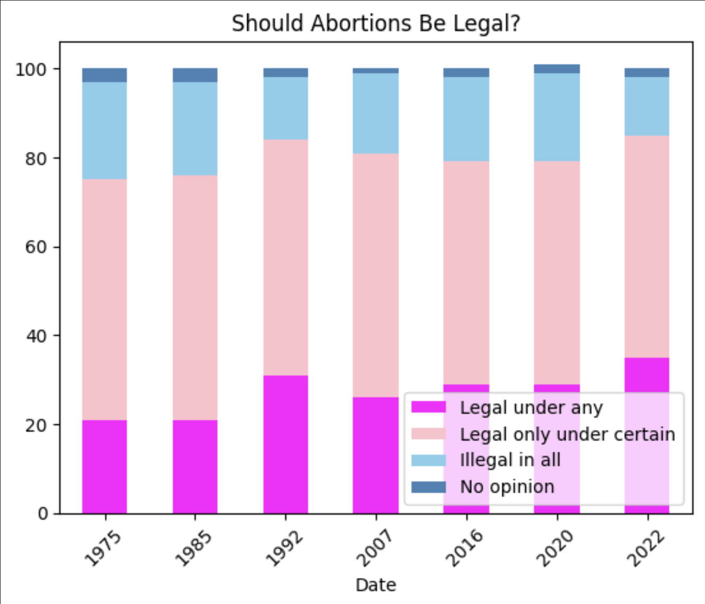
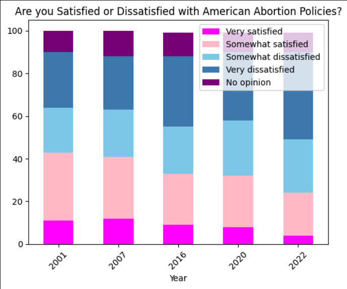
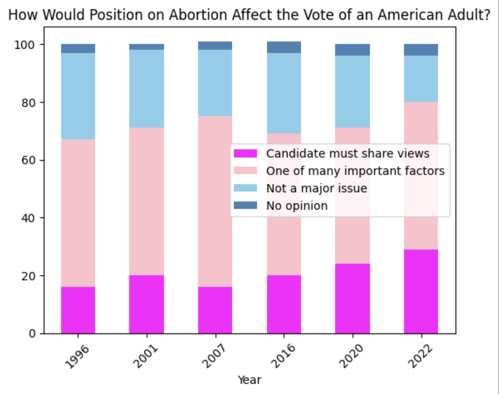
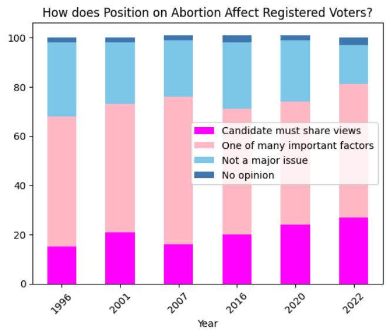
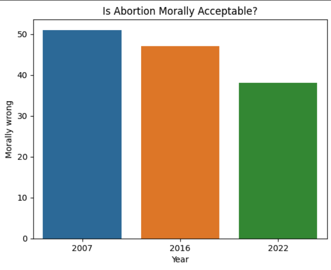

# “Choice” is dignity. 
# Moreover, “choice” is freedom. 

### Introduction
I simply cannot resist a brief history lesson -- the story of Roe v. Wade fascinates me:  
Jane Roe, born “Norma McCorvey" in 1947, lived in Texas under the custody of a single alcoholic mother. McCorvey was already married and pregnant by the time she reached my age; I still have trouble flipping eggs on a frying pan without breaking them in half. Facing a cold, harsh reality of harboring a life within her, only halfway through her teenage years after being raised in an insecure household, McCorvey had no choice but to carry a pregnancy to term before giving her own child away to her mother. 

Pregnant again in 1969, McCorvey wanted an abortion, which was inaccessible to her **unless** her life became threatened by the pregnancy. Subsequently, McCorvey was referred to feminist lawyers, Linda Coffee and Sarah Weddington, who were searching for a client to challenge abortion laws. By the time Coffee and Weddington changed Roe's case (McCorvey anonymized her name to Jane Roe) to a class-action lawsuit and a federal judge panel ruled that Texas’s abortion laws were unconstitutional, Mccorvey had given birth and gave this child up for adoption. However, when the state of Texas appealed, the Supreme Court ruled that women had the right to an abortion during the first trimester of pregnancy, “free of interference by the state,” in 1973. Thus, _Roe v. Wade_ was born. 

It is at this point (1973) in history that the [dataset](https://www.kaggle.com/datasets/justin2028/perspectives-on-abortion-1975-2022) I am extrapolating from becomes relevant, which "describes the **changing perspectives** on a woman's right to **choose** in America." 
As explained by [Justin Oh](https://www.kaggle.com/justin2028), who put together this dataset and posted it on [Kaggle](https://www.kaggle.com/), all official figures are from Gallup, a global analytics firm which is formerly known as the American Institute of Public Opinion. [Gallup](https://www.gallup.com/home.aspx) is uniquely equipped to properly illustrate how the American opinion on abortions has shifted between just after _Roe v. Wade_ and just before the _Dobbs v. Jackson Women's Health Organization_ ruling in June 2022, which effectively overturned the national precedent on abortion set by _Roe v. Wade_. 

To begin my exploration of America's shifting views on abortion, I analyzed the dataset corresponding to Question 1: **Should Abortions Be Legal?** 
This data contains responses to the poll from dates ranging from April 1975 (2 years after _Roe v. Wade_ was ruled) to May 2022 (the month before _Roe v. Wade_ was effectively overturned). 

Effectively, I begin this project with a "birds-eye view" of the general American sentiment regarding the legality of abortion during the period of time where _Roe v. Wade_ was in-effect. It is critical to note that the dataset corresponding to question 1 is based on the responses of registered votes -- to me, this most obviously implicates two things: 

First of all, in 2020, about [62.8%](https://www.pewresearch.org/fact-tank/2022/11/01/turnout-in-u-s-has-soared-in-recent-elections-but-by-some-measures-still-trails-that-of-many-other-countries/) of Americans of voting age voted in the _presidential_ election, showing that 40 percent of Americans either are not registered to vote, or do not regularly civically engage. For this reason, as I conduct my analysis on the responses to the poll in question one I am keeping in mind the fact that the poll responses cannot verifiably describe the true opinions of the American public, but still can provide a valuable generalization. 

Second, as both biological men and women can vote, the opinions of both biological men and women are included in the poll I am analyzing. However, as I am a firm believer in the fact that the choice to have an abortion must only involve the desires of the woman who is considering having one, and, moreover, that abortion is not at all a political issue, but one of basic women's health, I acknowledge that the question posed by this poll is one I inherently have problems with because it automatically frames abortion as a legal issue to be decided by the men (and women) in government. Still, I am very interested in extrapolating from this data to provide myself with a more objective understanding of America's views on abortion, in place of the heavily biased information I consume through the media. 

The program below utilizes the pandas .describe() function to calculate the mean, minimum value, and maximum value of the percentages of people affiliated with each category of the poll. 

To me, one of the most interesting pieces of data from this calculation is the mean percentage of Americans who believe that abortion should be legal only under certain circumstances (ie. during the first trimester of pregnancy, as established by _Roe v. Wade_), which equals about 53%. In my personal experience, abortion feels like a heavily polarized issue, with people either agressively arguing its immoraility and describing it as murder, or people expressing that they feel entirely unentitled to even have a personal opinion on the issue, effectively leaving abortion in the hands of women who choose to have one. Still, during the period of time when the _Roe v. Wade_ decision remained effective in America, about half of Americans shared a sentiment that reflected the Supreme Court's decision. Moreover, the maxiumum percent of Americans believing that abortion should be entirely illigal (even in the cases of sexual abuse or incest) reached 23%, with a minumum value of 12% over the course of 1975 through 2022. While I find that any amount of people that feel entitled to claim that abortion should be illigal in every circumstance is alarming, the amount of Americans that feel this way has never exceeded 2/5 of the country. Therefore, I am compelled to ask why 12 states -- about 25 percent of the country -- have abortion bans in effect

Interestingly about 27% (legal under any), legal only under certain (53%), illegal (18)
min legal under any (23%), min legal only under certain(48), min illegal(12)
max legal under any (35), max legal only under certain (61), max illegal (23)

Next, I created a copy of the dataset containing the responses to **Question 1** to only include data on the years included on the x-axis of the layered bar chart below. 

**Why the dates?**
* 1975: Two years after 

(data analyssi)

(limitations) 

(conslusion)

Please note that sections of my introduction have been taken from a larger research article I have been writing for the Folio 51 magazine on Reproductive Rights. 

Historical References: 
Bauer, Pat. "Norma McCorvey." Encyclopedia Britannica, 23 Jan. 2023, https://www.britannica.com/biography/Norma-McCorvey.

Britannica, The Editors of Encyclopaedia. "Roe v. Wade." Encyclopedia Britannica, 24 Aug. 2022, https://www.britannica.com/event/Roe-v-Wade.

Image References: 

[Thumbnail](https://www.nbcbayarea.com/news/national-international/photos-protests-erupt-across-the-nation-after-supreme-court-leak-of-roe-v-wade-draft-overturning-abortion-rights/2881065/)

[Cover](https://www.theatlantic.com/ideas/archive/2020/03/before-roe-v-wade/607609/)

[American Women Scorned](https://www.voanews.com/a/us-prepares-for-post-roe-v-wade-future/6632410.html) 

