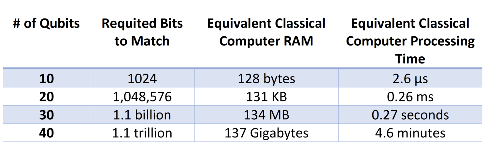

# What if Ant Man tried to enter the "Quantum Realm" by means of a quantum computer? Could we predict how long it would take him to go quantum?
## *- Naomi Gelfer, 1 week younger than present day*

Naomi Gelfer, 1 week younger than present day, was very ambitious. But, I have done my best to seek out ways to answer her mind-boggling question. Upon my quest for meaning in the quantum realm, my curious self could not stop herself from jumping directly into shining rabbit-holes filled with vast treasures of information regarding quantum computing, genome sequencing, D-Wave Systems quantum computers, clock speed, and programming regression lines in Altair. Even when one takes into account the fact that I am one week older than the Naomi Gelfer who posed me the original question (above), I am still not at the mental level that will allow me to fully comprehend quantum computing (and especially its applications in genome sequencing) -- BOOHOO :( (truly a shame -- I was most excited to become a professional in the field with a week's worth of research) 

However, fear not! The following is a valiant attempt at tackling an originally short question, which opened the door for a plethora of corollaries and (most welcome) frustrations...

Hold onto your hats! The following points of clarification are only the beginning of our roller-coaster ride: 
We will attack the question at an angle considering "what if Ant Man was processed by a quantum computer in order to enter the quantum realm?" Meaning: considering the fact that Ant Man entering the quantum realm is a fantasy in itself, what if we layered that with the possibility of him entering the quantum realm *by being processed by a quantum computer*.

Some background if you're lost: Ant Man (aka Scott Lang), by use of "Pym Particles" can access the Quantum Realm. Pym particles are capable or altering the size of objects or beings and are extra-dimensional in nature. The Quantum Realm, itself, is a universe outside of time and space, which Ant Man accesses by shrinking to beyond a sub-atomic size. I possess a scientific mind, and these Pym particles are synonymous to magic for me, so I am proposing another way for Ant Man to go quantum (very *simple* and very *clear*): being processed by a quantum computer. 

### Section 1: A simple (?) solution...
Ask me if I can describe myself in one word (go on...) well, hopefully you asked me. And, I can easily describe myself in one word -- albeit, a word that is between 3-3.5 billion letters long! (My genome!!!)
So, my next move: for Ant Man to be processed by a quantum computer, we have to ask who is Ant Man? What is Ant Man? Ant Man is just a man, and his name is Scott Lang. Scott Lang, in a more cold/harsh/scientific way, *is* his genome (for the purposes of this hypothetical). So, his unique self can be equated to somewhere around a 3.5 billion base-pair-long genome. Now, process this: as bits (the fundamental units of information used by classical computers) are stored as 0s or 1s, one bit can have two possible values, and two bits can have four possible values (yay combinatorics). In parallel, there are four DNA bases (ATGC) and four possible DNA base pairings, so each one in a sequence can be recorded as two bits of data. So one base pair = 2 bits. Scaling up, 4 million base pairs = 8 million bits = 1 million bytes (because 8 bits = 1 byte). I am sampling the math done by [this](https://www.thetech.org/ask-a-geneticist/articles/2019/does-our-dna-really-have-as-much-information-as-an-encyclopedia-set/#:~:text=Since%20there%20are%20four%20possible,8%20million%20bits%20of%20information) source, which explains that since humans have about 3.5 billion base pairs, this translates to 875 megabytes of data. One megabyte = 8 x 10^6 bits, so 875 megabytes = 7.3 x 10^9 bits.
Lots of unit conversions, I know, but lets take a pit stop before we continue: just to clarify, the amount of information stored within the human genome can be equated to about 7.3 x 10^9 bits of information (on a classical computer). 

Take a breath (if you need it).

Lets continue (!!!)

To understand our next unit conversion (as we, too, take a leap into the quantum realm with Ant Man), two key properties of quantum computers must be addressed: **Superposition and Quantum Entanglement**. 

In our classical computers, bits are either 0 **or** 1. But, Quantum computers use **qubits** which can be thought of as 0 **or** 1 **or** *both at the same time* (a state of superposition). In superposition (between measurements -- the second a qubit is measured, its state of superposition collapses), a qubit has some probability of being 0 and some probability of being 1, meaning it contains more information per processing unit than a classical bit. Then, regarding Entanglement, qubits can be "connected" even if they are separated. In other words, qubits can be made of electrons, whose spin goes in one of two directions (up or down), and when they are entangled, their spin becomes directly correlated. Essentially, as more and more qubits are entangled together, the computer's ability to make more calculations grows exponentially. On the other hand, a classical computer's ability to make calculations grows linearly with bits. Therefore, the following (especially for the purposes of our conversation at the moment) is true: 

### n qubits = 2^n bits 

[This](https://quantumtech.blog/2022/01/17/ten-fundamental-facts-about-quantum-computing/) source has helped me a great deal with sorting out the facts I just explained. 

Now that we all completely understand superposition and entanglement (obviously), we can use the equation above to find that log(base 2) (7.3 x 10^9) bits = (about) 32.77 qubits. 
In other words, Ant Man’s genome contains 32.77 qubits of information. 

If we just want to know how long it would take for a quantum computer to process (aka sequence) his genome, lets just first find out how long it would take a classical computer to process his genome, find out how much faster a quantum computer processes that amount of information, and BOOM done…

We can consult [this](https://quantumtech.blog/2022/01/17/ten-fundamental-facts-about-quantum-computing/) source for the following information: 

The chart (above) contains incredibly valuable information -- one thing I did in order to make sense of the data was to graph it using Altair: 

It is fascinating that there is a linear relationship between qubits (x-axis) and the logarithm of the time it would take a classical computer to process that amount of information in bits (y-axis). Moreover, the information in the chart makes everything seem so simple: if we rounded the Ant Man's 32.77 qubits of information to 30 qubits, then it would take a classical computer 0.26 ms to process an equivalent amount of information in bits. And, because we are currently upon the frontiers of quantum computing, it was difficult for me to verifiably find an answer to "how much faster is a quantum computer compared to a classical computer," so I'm using an [article](https://www.livescience.com/quantum-computing) from 2022, which states that quantum computers work 158 million times faster than the most sophisticated supercomputer in the present. And, staggeringly, a quantum computer can accomplish what takes a traditional supercomputer 10,000 years, in four minutes. 

So... easy? A classical computer would take 0.26ms to process a "bit" equivalent of Ant Man's 30 (ish) qubits, and so a quantum computer would send Ant Man directly into the quantum world **158 million** times faster -- an inconceivably speedy rate. Done?! So, with the help of quantum computers, instead of the fantastical Pym Particles, processing Ant Man (his soul aka genome), he goes quantum reeeaall fast?! 

And yet... I'm unsatisfied. Hopefully, you are too...

Unsatisfied with my work? **Good, you should be. It doesn't make any sense -- not at least for processing the human genome!!**

### Section 2: Silly Inquiries about Ant Man Pose Magnificent Demonstrations of the Power of Quantum Computing 

