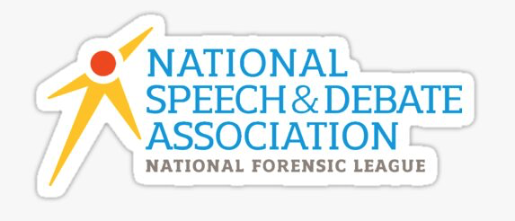
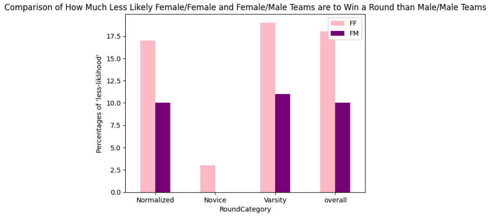
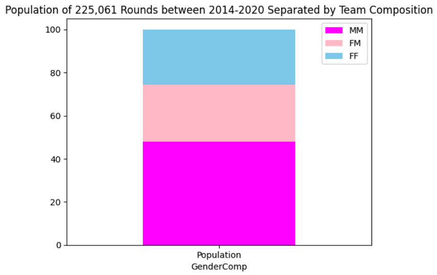
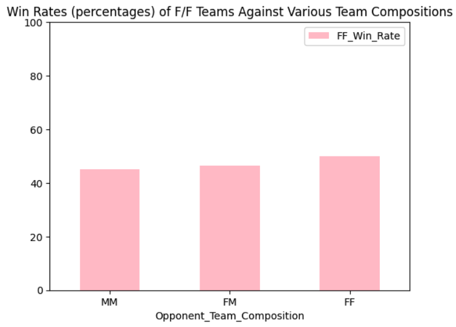
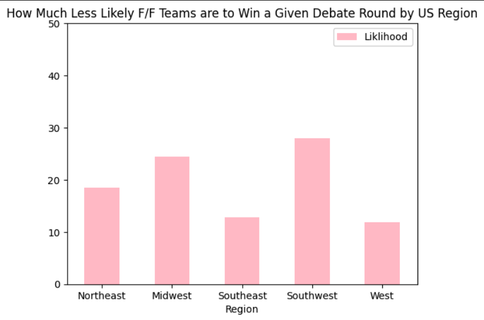
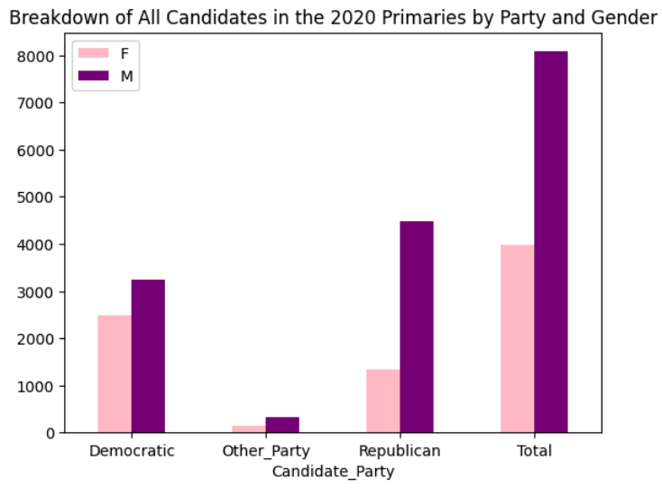
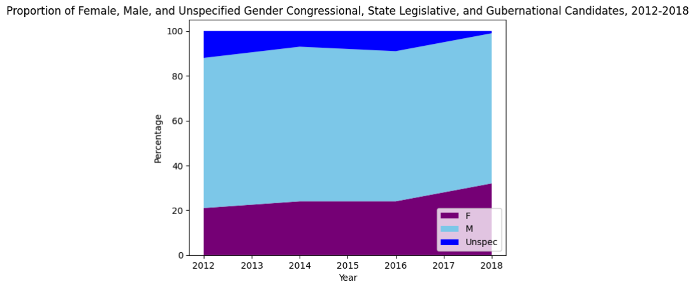
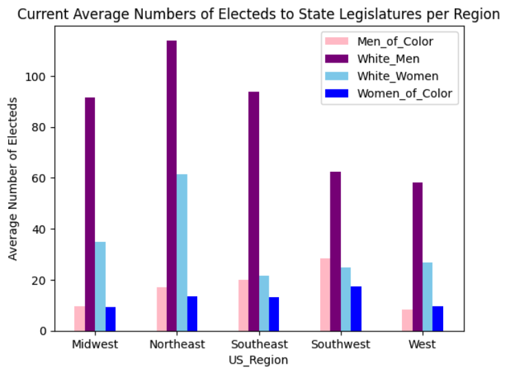
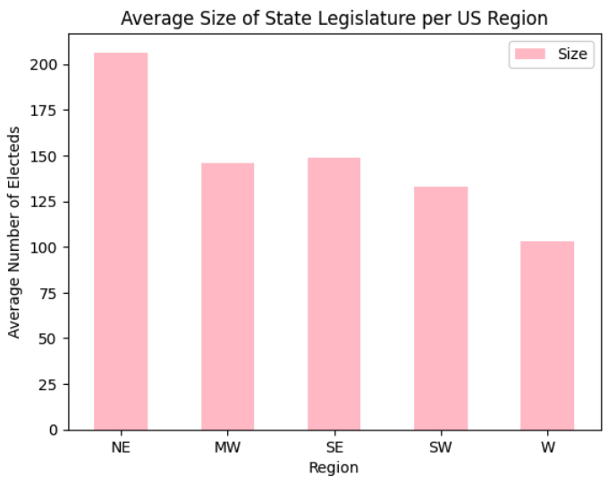

# An Argument Regarding the Demographics of Arguing

Picture this: you're eleven and one of the only two girls in your first middle school debate team meeting -- fighting to float  within a turbulent sea of boys (only recently having blossomed from prepubescence). That was me about 5 years ago. So, my best friend/debate partner and I did the only thing that could be done: build a fort of desks in the center of the room, while the rest of the boys took their seats behind desks against the walls of the room, encircling and encroaching upon our makeshift citadel. I've been fighting from within that fort to this day. 

As I make the ironic choice to open a data analysis project with purely anecdotal comments, I standby my following assertions. The high school competetive debate sphere in the United States (or, from my personal experience, in the Northeast) is riddled with **misogyny**, **bias**, and **inequity**. And, while I've had the privilege of emerging from the gates of Harvard campus, sleep-deprived but fueled by vendettas against all of the judges that "voted wrong," like I had just escaped a fever dream, the niche little bubble that I used to believe contained the debate sphere has popped a long time ago.  

A quick off-time road-map (teehee -- hopefully at least one of my readers is a debater...): in **section 1**, this project dives into visualizing critical empirics describing gender differences in competive high school debate. Then, we're skipping college and marching straight to state legislatures, the US Sentate, and the House of Representatives in **section 2**; specifically, section 2 will consist of data visualizations of the gender demographics of various election years in the past decade. Finally, to connect the first 2/3s of this post, **section 3** seeks to correlate what conclusions can be extrapolated from section 1 with the *very real* effects that the unequal and male-dominated political spheres we discovered in **section 2** have on our world.  

As you read this post, please keep in mind that feminism and every invidual's intersectionality can never be mutually exclusive: the American reality puts white women at an advantage when compared to women of color. My experiences as a debater have been directly informed by my identity as a young, white cisgender woman. As we draw conclusions from the data I present in this post, we must emphasize that feminism is not one-dimensional, even if some of the datasets I utilize solely separate debaters or legislators by gender. Moreover, one clear and initial limitation of the datasets used for this post derives from the fact that gender is not a binary, but not all of the datasets take this fact into account. 

My ultimate decision to compile this project was fueled by my passions to never stop defending what I believe in. Every single member of this generation, including the thousands of competitive debaters, represents all of our futures.

# Section 1: Welcome to High School Debate

In 2020, Alyssa Nie and AJ Yi, after constructing and analyzing a dataset with 44 variables and 125,087 unique debate rounds during the 2014-2015 to 2019-2020 school years, [published](https://papers.ssrn.com/sol3/papers.cfm?abstract_id=3715996) _"An Empirical Study of Gender Differences in Competitive High School Debate"_ to the Social Science Research Network Database. Specifically, Nie and Yi examined 344 of the 388 total TOC (Tournament of Champions) Qualifying Tournaments during those years by building a webscraper to obtain data from variation tabulation platforms that published tournament results. All of the following visualizations are based on data collected by Nie and Yi.

### Part 1: The Biases Before a Round Even Begins

The graph above allows us to visualize the bias that parasitically invades every single tournament room before the debaters even walk in. The first group of bars (under the category, "normalized") take into account controls for the grade level of debate teams and various team level controls to provide a general conclusion about how much less likely Female/Female (F/F) and Female/Male (F/M) teams are to win a round than a Male/Male (M/M) team across the board. The immediate conclusions this part of the graph points to are jarring: F/M teams are about 10% less likely to win around compared to their M/M counterparts. But, at over 150% of that disadvantage, F/F teams are nearly 17.5% less likely to win **any given round** than a M/M team. These devastatingly discouraging biases are present at every single round.

Then, the "Novice" and "Varsity" bar groups add critical context to our story: at the novice level, F/M teams are at no statistically significant disadvantage compared to their M/M counterparts when they walk into a tournament room. For a F/F team, this disadvantage is relatively small when compared to the heights of all of the other bars on the graph. But, once debaters join the acclaimed ranks of the "varsity debate level," everything changes. Varsity F/F teams likely find themselves at the largest disadvantage compared to both their F/M and M/M team counterparts that they have ever experienced. And, from having an unbiased, equal shot at winning a round against a M/M team solely based on the gender composition of their team, F/M varsity teams are all of a sudden about 11% less likely to win a round than M/M teams. One crucial takeaway from my analysis of this graph is that rates of female attrition compound with experience, which only push once-inspired and driven female debaters further away from their dreams of public-speaking success. Also, males on F/M teams at the varsity level may feel the disadvantage displayed on this graph, and may be more likely to leave their female partners for a new male partner, leaving once-successful females partner-less and unable to continue with the activity (unless if they find another female partner who has also been left alone -- in a partnership against the highest level of round bias they've ever experienced). A consistent aspect of this graph is the fact that being a member of F/F team would put you at the greatest disadvantage. 

For reference, the grouped bars labeled as "overall" refer to how much less likely a F/F or F/M team is to win when compared with a M/M team WITHOUT taking into account all of the controls that the "Normalized" bars do. 

Now, with the above overview of the biases that materialize solely due to a team's gender composition *before a round even begins* in mind, let's look at some informative statistics on what's actually going on during and after debate tournaments. 

### Part 2: Correlating the Debate Sphere's Gender Composition with F/F Win Rates and Quit Rates through a Synergetic Relationship

For the over 225,000 rounds that in Nie and Yi’s dataset, I have visualized the proportion of gender composition for all round observed. Making up nearly 50% of almost all TOC Qualifier rounds, M/M teams dominate the debate niche. As for the remaining 50% of teams, F/M and F/M make up about half and half. 

Understanding the more subtle but forceful impacts of debate *still* being male dominated is crucial before we correlate this graph with F/F team win and quit rates. In between rounds, high school cafeterias and college campuses are flooded with high school debaters -- in my experience, these areas are occupied by a majority of boys, where it’s difficult to find another group of girls in the room. Then, while public forum debate requires a lot of collaborative prep work, my identity as a girl has left me shut out from unofficial meetings and group Face-Times between boys on my team as they prepared for the coming tournament. Moreover, as different school teams at tournaments seek to collaborate with each other (to share notes against collective “enemies”), I have never been approached for help by another team, while the boys sitting next to me become easily surrounded by other teams begging for shared prep. As a middle schooler, I was self conscious of my especially high pitched voice, and shrunk before every adult (and inexperienced) male judge as he felt the need to lecture me about the topic I spent months preparing. During the pandemic, boys teams would visibly laugh at my partner and I, while they were on mute, as we’d give speeches during rounds. While the gender I present as certainly does not inform every single one of my experiences as a debater, microaggressions and clear gender biases have continuously threatened to push me out of the activity altogether. 

On that note, take a look at the graph below:

With F/F teams already making up the minority of teams you’ll see at a debate tournament, the greater the number of males they debate against, the lower their win rate is. F/F teams only win 45% of the rounds they debate against M/M teams, and while it may be easy to disregard the graph above and mislabel the differences between each bar as insignificant, the biased and discouraging win rates for F/F teams exacerbate the common microaggressions and sense of marginalization that I just discussed.
Let’s check this empirically: Nie and Yi calculated that (with specific normalizing controls), female debaters are 30.34% more likely to quit than male debaters. And, we can watch this alarming likelihood of girls to be driven out from debate through the numbers: Nie and Yi found a higher proportion of female than male underclassman debaters. But, once debaters enter the varsity level (generally, in junior and senior year), male debaters completely overtake females as the majority. Therefore, I argue that the biased win rates and likelihood to lose that plague female debate teams (*especially* once they enter the varsity level) contribute to them being driven out of the activity, which only decreases the proportion of female representation in debate, so this cycle continues. 

Fascinatingly, female debaters would be 92.51% less likely to quit if their win ratio was raised one unit, Yi and Nie reported: the unfair win rates for F/F teams have a direct effect on their likelihood to quit altogether. 

### Part 3: Breakdown by Region

As we prepare to move away from high school debate and to US legislative bodies, keep what you take away from the graph below in mind.

For most teams, the region they debate in is their home region, meaning it is quite difficult, inconvenient, and financially straining to “simply” start debating in a region where gender biases are less prevalent. Therefore, F/F teams in the American southwest (in states such as Texas and Arizona) find themselves at 28.0% less likely to win a round the second they walk into a room containing at least one male debater. While this unfair skew decreases the most in the West (11.9%), there is no American region where F/F teams do not face bias before they even read their speech. 

Finally, before we move on, to those of you considering “maybe F/F teams lose more because they’re worse”: stop. I’m extremely confident in asserting that gender has absolutely nothing to do with one’s ability to present and argument and defend it. We say that at the novice level, where female debaters actually make up the gender majority, F/F and F/M teams experience the lowest attrition rates in terms of how much less likely they are to win a round than a M/M team. Once the exhausting microaggressions and seemingly continuous losses start rolling in with experience, female debaters are compelled to quit the activity, only exacerbating the cycle of marginalization and loss for female debaters. 

# Section 2: Visualization of US Legislative Bodies by Gender and Race

Using data from the [Reflective Democracy Campaign]([https://www.kaggle.com/datasets/justin2028/perspectives-on-abortion-1975-2022](https://wholeads.us/datasets/) Reflective Democracy Campaign, the graph below separates all of the congressional, statewide office, and state legislature primary election candidates in 2020 down party lines and by registered gender. 

Looking at the “total” bar group, the 2020 primary male candidates visually outnumber all of the female candidates by 150%. Then, while slightly more republican candidates ran (a difference of about 75 candidates), the republican party was represented a much more jarring proportion of men, while the proportion of male to female democratic candidates was relatively closer to half/half. Critically, the graph above shows that a lot more men are running for office than women across the entire country and all parties (*still*).   

The dataset used for this graph also contains information on the winners of the 2020 primaries: men made up 66.8% (≈ ⅔) of the electeds, while women made up the remaining 33.2% (≈ ⅓) of the winners. Recall the gender breakdown of the TOC rounds we looked at in **section 1**, **part 2**, where Male/Male teams made up about 50% of all rounds and M/F teams made up an additional 25%. Where completely male teams dominated 50% of the debate scene (and teams with at least one male left only a quarter of debate teams to be F/F), this proportion gets blown up across the US’s state governments. While these comparisons are correlational, teens in debate often aspire to become active members of the government, so the relationship between the marginalization of women in both competitive debate and the state of the government is somewhat unsurprising to me :(

# Section 3: title

